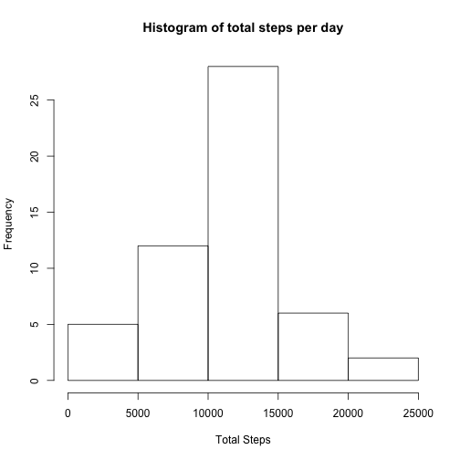
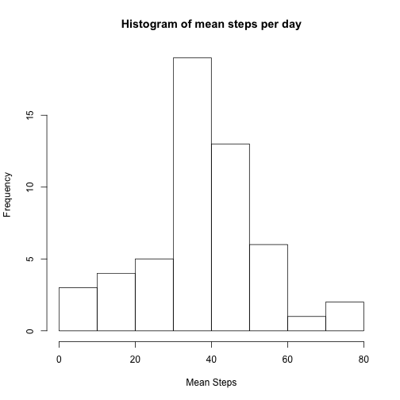
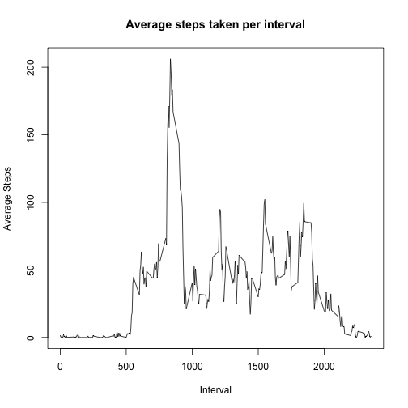
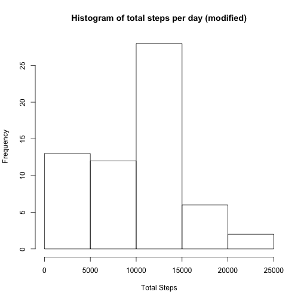
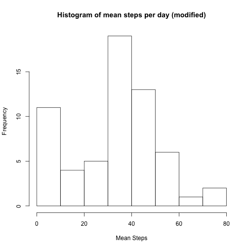
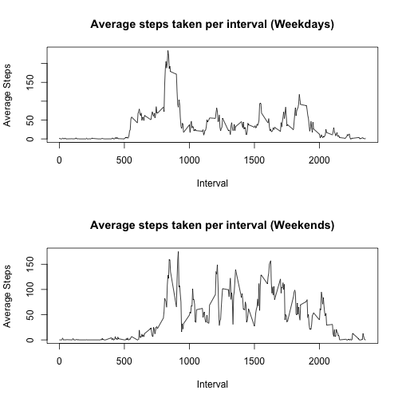

---
title: "Peer Assessment 1 - Reproducible Research"
author: "Navnit Belur"
date: "March 13, 2015"
output: html_document
--- 

###Loading and preprocessing of the data

The data source [zip] file has been downloaded and extracted to the corresponding csv file. 
The data is read into a data frame using the read.csv command.
The data is cleaned by removing all rows containing NA values as this could bias other calculations:


```r
activityRaw <- read.csv("activity.csv")
activity <- na.omit(activityRaw)
```


Following is a summary of the "clean" data:


```r
summary(activity)
```

```
##      steps                date          interval     
##  Min.   :  0.00   2012-10-02:  288   Min.   :   0.0  
##  1st Qu.:  0.00   2012-10-03:  288   1st Qu.: 588.8  
##  Median :  0.00   2012-10-04:  288   Median :1177.5  
##  Mean   : 37.38   2012-10-05:  288   Mean   :1177.5  
##  3rd Qu.: 12.00   2012-10-06:  288   3rd Qu.:1766.2  
##  Max.   :806.00   2012-10-07:  288   Max.   :2355.0  
##                   (Other)   :13536
```


and the structure:


```r
str(activity)
```

```
## 'data.frame':	15264 obs. of  3 variables:
##  $ steps   : int  0 0 0 0 0 0 0 0 0 0 ...
##  $ date    : Factor w/ 61 levels "2012-10-01","2012-10-02",..: 2 2 2 2 2 2 2 2 2 2 ...
##  $ interval: int  0 5 10 15 20 25 30 35 40 45 ...
##  - attr(*, "na.action")=Class 'omit'  Named int [1:2304] 1 2 3 4 5 6 7 8 9 10 ...
##   .. ..- attr(*, "names")= chr [1:2304] "1" "2" "3" "4" ...
```


###Mean total steps per day

Note: the following code requires the 'dplyr' package.


####1. Calculate the total number of steps taken per day. 

First sumamrize the total steps and mean steps per day by grouping by date using dplyr


```r
activity %>%
  group_by(date) %>%   
    summarize (
      totalSteps = sum(steps, na.rm = TRUE)
    )
```

```
## Source: local data frame [53 x 2]
## 
##          date totalSteps
## 1  2012-10-02        126
## 2  2012-10-03      11352
## 3  2012-10-04      12116
## 4  2012-10-05      13294
## 5  2012-10-06      15420
## 6  2012-10-07      11015
## 7  2012-10-09      12811
## 8  2012-10-10       9900
## 9  2012-10-11      10304
## 10 2012-10-12      17382
## ..        ...        ...
```
 
####2. Histograms

Plotting the histogram of total steps per day by calculating the sum aggregates per day 
and then plotting the histogram:


```r
totalStepsPerDay <- aggregate(activity$steps, by = list(activity$date), sum, na.rm = TRUE)
hist(totalStepsPerDay$x, main = "Histogram of total steps per day", xlab = "Total Steps")
```

 


Plotting the histogram of average steps per day by calculating the mean aggregates per day 
and then plotting the histogram:


```r
meanStepsPerDay <- aggregate(activity$steps, by = list(activity$date), mean, na.rm = TRUE)
hist(meanStepsPerDay$x, main = "Histogram of mean steps per day", xlab = "Mean Steps")
```

 

####3. Mean and Median Summaries 

Sumamrize the mean and median steps per day by grouping by date using dplyr:


```r
activity %>%
  group_by(date) %>%   
    summarize (
      meanSteps = mean(steps, na.rm = TRUE),
      medianSteps = median(steps, na.rm = TRUE)
    )
```

```
## Source: local data frame [53 x 3]
## 
##          date meanSteps medianSteps
## 1  2012-10-02   0.43750           0
## 2  2012-10-03  39.41667           0
## 3  2012-10-04  42.06944           0
## 4  2012-10-05  46.15972           0
## 5  2012-10-06  53.54167           0
## 6  2012-10-07  38.24653           0
## 7  2012-10-09  44.48264           0
## 8  2012-10-10  34.37500           0
## 9  2012-10-11  35.77778           0
## 10 2012-10-12  60.35417           0
## ..        ...       ...         ...
```


### Average Daily Activity Pattern

####1. Time series plot

Below is the time series plot of the 5 minute intervals (x-axis) and the average number of steps taken, averaged across all days (y-axis):

Note: We need to convert the intervals to a different format otherwise the data will not be handled correctly. Specifically there will be "jumps" from integer value 55 to 100 as opposed to going from "time" 00:55 to 01:00 ... and this occurs every hour when treating time as integers as is with the original data. However, since this assignment is about "reproducible" research I am ignoring this for now. 


```r
meanStepsPerInterval <- aggregate(activity$steps, by = list(activity$interval), mean, na.rm = TRUE)
plot(x = meanStepsPerInterval$Group.1, 
     y = meanStepsPerInterval$x, 
     type = "l", 
     main = "Average steps taken per interval", 
     xlab = "Interval", 
     ylab = "Average Steps")
```

 


####2. Time of max number of steps

Maxmimum average #steps for a specific time interval and the corresponding time interval which contains the highest averaged step counts are:


```r
max(meanStepsPerInterval$x)
```

```
## [1] 206.1698
```

```r
meanStepsPerInterval$Group.1[which.max(meanStepsPerInterval$x)]
```

```
## [1] 835
```

So around 8:35 AM is when the average step count is the highest (about 206). 


### Imputing missing values

####1. Number of missing values

The number of missing values is the the numRows in the original raw data frame minus the numRows in the cleaned (removed NA rows) in the clean data set:


```r
nrow(activityRaw) - nrow(activity)
```

```
## [1] 2304
```

####2. Strategy for missing rows

In order to compensate for the missing rows, a new data frame will be constructed using the **median** value of **ALL** steps.

####3. Data frame construction

Read the 'mod' activity from the csv file again and then replace all values of steps column that are NA with the median of ALL steps values:


```r
activityMod <- read.csv("activity.csv")
str(activityMod)
```

```
## 'data.frame':	17568 obs. of  3 variables:
##  $ steps   : int  NA NA NA NA NA NA NA NA NA NA ...
##  $ date    : Factor w/ 61 levels "2012-10-01","2012-10-02",..: 1 1 1 1 1 1 1 1 1 1 ...
##  $ interval: int  0 5 10 15 20 25 30 35 40 45 ...
```

```r
activityMod$steps[which(is.na(activityMod$steps))] <- median(activityMod$steps, na.rm = TRUE)
str(activityMod)
```

```
## 'data.frame':	17568 obs. of  3 variables:
##  $ steps   : num  0 0 0 0 0 0 0 0 0 0 ...
##  $ date    : Factor w/ 61 levels "2012-10-01","2012-10-02",..: 1 1 1 1 1 1 1 1 1 1 ...
##  $ interval: int  0 5 10 15 20 25 30 35 40 45 ...
```

Note that after the replacement, the [visible] NAs have been changed to the median value (0) in this case. 

####4. Histograms, mean and median summaries


First sumamrize the total, mean, and median steps for the new data frame per day by grouping by date using dplyr


```r
activityMod %>%
  group_by(date) %>%   
    summarize (
      totalSteps = sum(steps, na.rm = TRUE),
      meanSteps = mean(steps, na.rm = TRUE),
      medianSteps = median(steps, na.rm = TRUE)
    )
```

```
## Source: local data frame [61 x 4]
## 
##          date totalSteps meanSteps medianSteps
## 1  2012-10-01          0   0.00000           0
## 2  2012-10-02        126   0.43750           0
## 3  2012-10-03      11352  39.41667           0
## 4  2012-10-04      12116  42.06944           0
## 5  2012-10-05      13294  46.15972           0
## 6  2012-10-06      15420  53.54167           0
## 7  2012-10-07      11015  38.24653           0
## 8  2012-10-08          0   0.00000           0
## 9  2012-10-09      12811  44.48264           0
## 10 2012-10-10       9900  34.37500           0
## ..        ...        ...       ...         ...
```
 
Plotting the histogram of total steps per day by calculating the sum aggregates per day 
and then plotting the histogram:


```r
totalStepsPerDayMod <- aggregate(activityMod$steps, by = list(activityMod$date), sum, na.rm = TRUE)
hist(totalStepsPerDayMod$x, main = "Histogram of total steps per day (modified)", xlab = "Total Steps")
```

 

Plotting the histogram of average steps per day by calculating the mean aggregates per day 
and then plotting the histogram:


```r
meanStepsPerDayMod <- aggregate(activityMod$steps, by = list(activityMod$date), mean, na.rm = TRUE)
hist(meanStepsPerDayMod$x, main = "Histogram of mean steps per day (modified)", xlab = "Mean Steps")
```

 

By inspection, we see that the new mean and medians and especially the histograms are now biased and the frequency of mean steps is higher in the lower averages compared to the cleaned data set. 


###Weekdays and Weekends

####1. Segregate into weekdays and weekends

First split find the corresponding 'days' for each date and mutate the data frame to add this column. Then filter out weekdays and weekends into separate data frames as needed for plotting. 


```r
activity <- mutate(activity, days = as.factor(weekdays(as.Date(as.character(activity$date)))))

activityWeekdays <- filter(activity, (days == "Monday" | days == "Tuesday" | days == "Wednesday" | days == "Thursday" | days == "Friday"))
activityWeekends <- filter(activity, (days == "Saturday" | days == "Sunday"))
str(activityWeekdays)
```

```
## 'data.frame':	11232 obs. of  4 variables:
##  $ steps   : int  0 0 0 0 0 0 0 0 0 0 ...
##  $ date    : Factor w/ 61 levels "2012-10-01","2012-10-02",..: 2 2 2 2 2 2 2 2 2 2 ...
##  $ interval: int  0 5 10 15 20 25 30 35 40 45 ...
##  $ days    : Factor w/ 7 levels "Friday","Monday",..: 6 6 6 6 6 6 6 6 6 6 ...
```

```r
str(activityWeekends)
```

```
## 'data.frame':	4032 obs. of  4 variables:
##  $ steps   : int  0 0 0 0 0 0 0 0 0 0 ...
##  $ date    : Factor w/ 61 levels "2012-10-01","2012-10-02",..: 6 6 6 6 6 6 6 6 6 6 ...
##  $ interval: int  0 5 10 15 20 25 30 35 40 45 ...
##  $ days    : Factor w/ 7 levels "Friday","Monday",..: 3 3 3 3 3 3 3 3 3 3 ...
```

####2. Plots


```r
par(mfrow = c(2,1))

# plot 1 
meanStepsPerIntervalWeekdays <- aggregate(activityWeekdays$steps, by = list(activityWeekdays$interval), mean, na.rm = TRUE)
plot(x = meanStepsPerIntervalWeekdays$Group.1, 
     y = meanStepsPerIntervalWeekdays$x, 
     type = "l", 
     main = "Average steps taken per interval (Weekdays)", 
     xlab = "Interval", 
     ylab = "Average Steps")


# plot 2 
meanStepsPerIntervalWeekends <- aggregate(activityWeekends$steps, by = list(activityWeekends$interval), mean, na.rm = TRUE)
plot(x = meanStepsPerIntervalWeekends$Group.1, 
     y = meanStepsPerIntervalWeekends$x, 
     type = "l", 
     main = "Average steps taken per interval (Weekends)", 
     xlab = "Interval", 
     ylab = "Average Steps")
```

 
